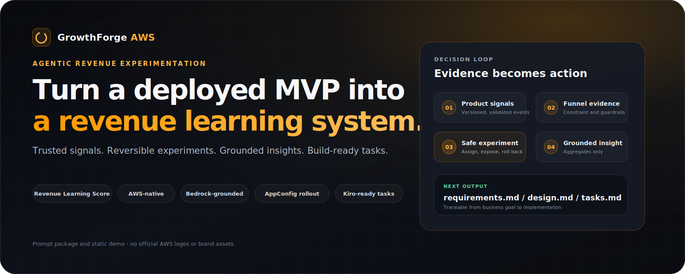
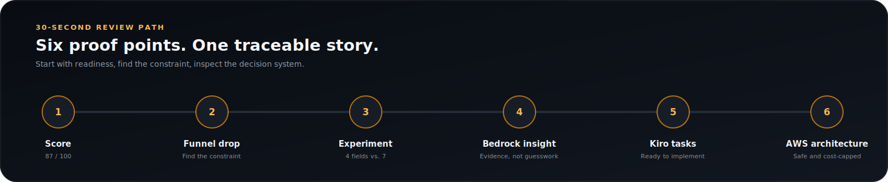
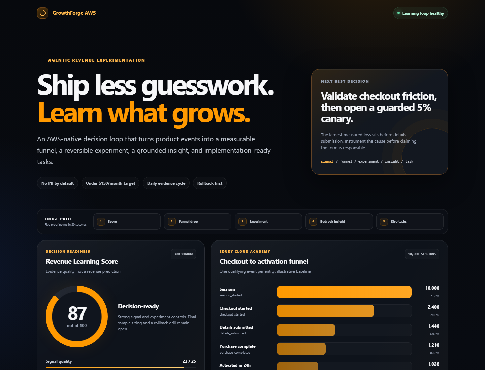
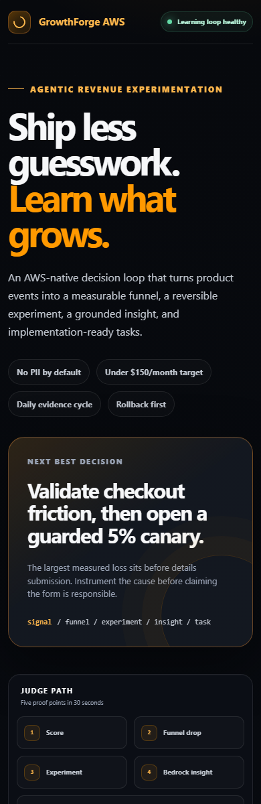
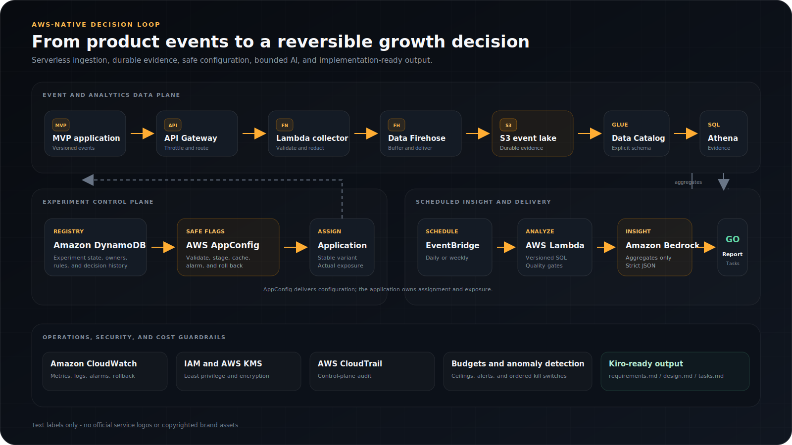
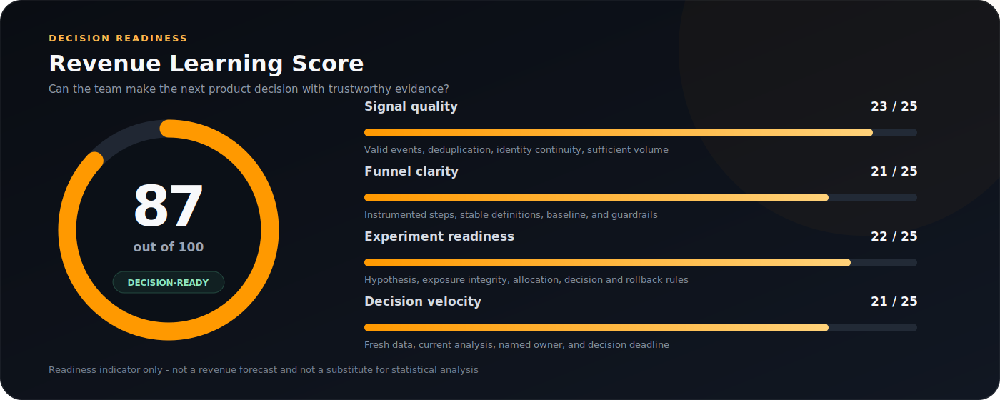

# GrowthForge AWS

## Turn a deployed MVP into a revenue learning system

**GrowthForge AWS is a production-minded, copy-paste prompt that designs an AWS-native experimentation stack for early-stage products.** It converts a startup brief into an event taxonomy, measurable funnel, prioritized experiment backlog, safe feature-flag plan, Amazon Bedrock insight workflow, cost controls, and Kiro-ready implementation tasks.

> Most cloud prompts stop when the application is online. GrowthForge starts there.

`Revenue Learning Score` | `AWS-native` | `Bedrock-grounded` | `AppConfig experiments` | `Kiro-ready tasks` | `Cost-capped`

> **Why judges should care:** GrowthForge connects the post-deployment disciplines startups usually assemble separately - product analytics, controlled experimentation, grounded AI, AWS operations, FinOps, and implementation planning - around one accountable growth decision.

[Open the 30-second demo](demo/index.html) | [Copy the master prompt](prompt/growthforge-master-prompt.md) | [Read the judge one-pager](JUDGE_ONE_PAGER.md)

### For judges

| 45-second path | Evidence |
| --- | --- |
| [Executive one-pager](JUDGE_ONE_PAGER.md) | The problem, differentiation, AWS value, and review path |
| [Static demo](demo/index.html) | Score -> funnel drop -> experiment -> Bedrock insight -> Kiro tasks |
| [Evidence pack](EVIDENCE_PACK.md) | Claim-by-claim production, security, cost, and reusability checks |
| [Final submission](submission.md) | Challenge-ready copy and final pitch |
| [Worked generated output](examples/generated-output-example.md) | Architecture, events, funnel, experiment, score, insight, and controls |

Record a 30-45 second walkthrough using the static demo path.

### Live demo

[GitHub Pages demo placeholder](https://YOUR_GITHUB_USERNAME.github.io/GrowthForge-AWS/demo/) | [Local repository fallback](demo/index.html)

> Replace `YOUR_GITHUB_USERNAME` after GitHub Pages is enabled.

## 30-second review path



1. **Score:** confirm whether the startup has enough trustworthy evidence to decide.
2. **Funnel drop:** identify the largest measurable constraint.
3. **Experiment:** inspect the hypothesis, variants, guardrails, and rollback rules.
4. **Bedrock insight:** verify that AI interpretation is grounded in computed aggregates.
5. **Kiro tasks:** trace the recommendation into requirements, design, and implementation.
6. **AWS architecture:** review the serverless data, control, insight, security, and cost boundaries.

## Static demo preview

<p align="center">
  <a href="demo/index.html">
    
  </a>
  <a href="demo/index.html">
    
  </a>
</p>

<p align="center"><strong><a href="demo/index.html">Open the interactive one-file demo</a></strong></p>

---

## The problem

Shipping an MVP does not answer the questions that determine whether it becomes a business:

- Where do users abandon the path to value?
- Which product change should the team test next?
- Is a conversion movement real, or just low-volume noise?
- Can an experiment be released and reversed without a deployment?
- How can a small team learn without buying a large analytics stack or creating an unbounded AI bill?

Early-stage teams often have application logs but no stable product event contract, dashboards but no decision rule, and feature flags but no experiment governance. The result is activity without reliable learning.

## The solution

GrowthForge gives an AI assistant, Kiro, or another agentic coding tool a strict architecture and output contract. From a small startup input, it produces:

1. A minimal event collection path built for replay, validation, and no PII by default.
2. A revenue funnel with explicit denominators, windows, and guardrails.
3. An experiment registry and AWS AppConfig feature-flag strategy.
4. A scheduled analysis workflow that uses Amazon Bedrock to explain evidence, not invent it.
5. A **Revenue Learning Score** that exposes whether the team can make a decision.
6. Kiro-ready `requirements.md`, `design.md`, and `tasks.md` artifacts.
7. Least-privilege, encryption, audit, rollback, observability, and cost controls.

This repository is the prompt package and an illustrative demo. It is intentionally not a full SaaS implementation.

## Why this wins

- **It solves the question after deployment.** The output is a growth decision loop, not another infrastructure checklist.
- **It connects strategy to implementation.** One brief becomes events, metrics, an experiment, rollback rules, AWS resources, and Kiro-ready work.
- **It uses AI with evidence boundaries.** Bedrock receives computed aggregates, cites supplied metrics, and can return `insufficient_evidence`.
- **It is startup-proportional.** Serverless services, a configurable cost ceiling, scan limits, retention, budgets, and kill switches prevent platform overbuild.
- **It is reviewable in under a minute.** The demo, one-pager, evidence pack, worked output, and architecture all tell the same traceable story.

## Who this is for

- Early-stage startups moving from launch to repeatable learning
- Indie hackers who need disciplined analytics without a dedicated data team
- SaaS founders improving acquisition, checkout, activation, or retention
- Product-minded developer teams that want AWS-native building blocks
- Teams with a deployed MVP but no confident answer to "what should we improve next?"

## What the prompt generates

| Deliverable | What it contains |
| --- | --- |
| Executive architecture | Assumptions, boundaries, data flow, and deployment stages |
| Event contract | Versioned event envelope, taxonomy, validation, and PII rules |
| Funnel specification | Ordered steps, conversion formulas, windows, and SQL approach |
| Experiment plan | Hypotheses, variants, allocation, guardrails, stop rules, and owners |
| Feature-flag design | AWS AppConfig profiles, validators, rollout, exposure logging, and rollback |
| Insight workflow | Deterministic metrics plus grounded Amazon Bedrock interpretation |
| Revenue Learning Score | A 0-100 readiness score with evidence and remediation |
| AWS implementation plan | Service-by-service resources, IAM boundaries, alarms, and estimates |
| Kiro artifacts | Testable requirements, architecture decisions, and dependency-ordered tasks |
| Runbook | Validation, troubleshooting, rollback, kill switch, and cost response |

## AWS architecture at a glance



The collector validates and enriches events before Amazon Data Firehose delivers them to a partitioned S3 event lake. AWS Glue provides table metadata and Athena computes funnel and experiment metrics. EventBridge starts a bounded analysis job; Amazon Bedrock receives only aggregated, structured evidence. DynamoDB stores experiment state, while AWS AppConfig distributes validated feature flags with gradual deployment and CloudWatch-alarm rollback.

AWS AppConfig is used for safe configuration delivery. Stable variant assignment, exposure logging, and experiment analysis are explicitly designed by the generated plan rather than presented as native AppConfig statistical experimentation.

See [the detailed architecture and editable Mermaid diagram](architecture/architecture.md).

## Revenue Learning Score

The Revenue Learning Score answers a practical question: **does this team have enough trustworthy evidence and operating discipline to make the next product decision?**



```text
Revenue Learning Score =
  Signal quality
  + Funnel clarity
  + Experiment readiness
  + Decision velocity
```

Each component is scored from 0 to 25 using declared thresholds. The example score of **87/100** is `23 + 21 + 22 + 21`. It is a readiness indicator, not a prediction of revenue and not a substitute for statistical analysis.

## Demo walkthrough

1. Open [`demo/index.html`](demo/index.html) in a browser.
2. Read the 87/100 score and the weakest component: decision velocity.
3. Scan the checkout funnel to find the largest drop from checkout start to details submitted.
4. Review the recommended 4-field checkout experiment and its guardrails.
5. See the Bedrock insight grounded in computed metrics.
6. Preview the Kiro implementation tasks and AWS service footprint.

The demo is one responsive HTML file with no build step, network calls, external fonts, scripts, or images.

## Repository structure

```text
.
|-- README.md
|-- JUDGE_ONE_PAGER.md
|-- EVIDENCE_PACK.md
|-- CONTRIBUTING.md
|-- LICENSE
|-- package.json
|-- package-lock.json
|-- submission.md
|-- index.html
|-- .github/workflows/validate.yml
|-- .github/workflows/pages.yml
|-- assets/
|   `-- readme/
|       |-- architecture-diagram.svg
|       |-- demo-screenshot-mobile.png
|       |-- demo-screenshot.png
|       |-- hero.svg
|       |-- judge-path.svg
|       `-- revenue-learning-score.svg
|-- architecture/
|   `-- architecture.md
|-- demo/
|   `-- index.html
|-- docs/
|   |-- aws-services.md
|   |-- prerequisites.md
|   |-- security-cost-controls.md
|   |-- troubleshooting.md
|   |-- use-case.md
|   `-- well-architected-mapping.md
|-- examples/
|   |-- generated-output-example.md
|   |-- kiro-tasks-example.md
|   `-- startup-input-example.md
|-- scripts/
|   `-- capture-readme-assets.mjs
`-- prompt/
    `-- growthforge-master-prompt.md
```

## How to use the prompt

1. Open [`prompt/growthforge-master-prompt.md`](prompt/growthforge-master-prompt.md).
2. Copy the entire prompt into Kiro or an agentic coding assistant.
3. Replace the `STARTUP INPUT` placeholders with the product, funnel, traffic, region, budget, and compliance context.
4. Answer the assistant's blocking clarifying questions.
5. Review the assumptions and cost model before accepting implementation tasks.
6. Implement in the generated stages: instrumentation, analytics, flags, insights, then optimization.

Start with the [Eduky Cloud Academy input](examples/startup-input-example.md) to see the expected level of detail.

## Expected outputs

A compliant response from the master prompt contains:

- Assumptions and unresolved risks
- Mermaid architecture and written data flow
- Versioned JSON event envelope and event taxonomy
- Funnel table and sample Athena SQL
- Prioritized experiment backlog
- Recommended experiment specification
- AWS AppConfig flag document and validator approach
- Amazon Bedrock evidence schema and insight prompt
- Revenue Learning Score calculation
- AWS resource, IAM, KMS, CloudTrail, and CloudWatch plan
- Monthly cost model with warning and shutdown thresholds
- Reliability, rollback, troubleshooting, and validation runbooks
- AWS Well-Architected mapping
- Complete `requirements.md`, `design.md`, and `tasks.md` content

## Security, cost, and observability

**Security**

- Reject unknown event versions and malformed payloads at ingestion.
- Collect no direct PII by default; use opaque internal identifiers.
- Encrypt S3, DynamoDB, logs where configured, and AppConfig data with AWS KMS.
- Scope each runtime role to the resources and actions it actually needs.
- Record control-plane activity with AWS CloudTrail.

**Cost**

- Favor serverless, usage-based services and daily or weekly batch analysis.
- Partition and compress S3 data; constrain Athena workgroups and query scan volume.
- Invoke Bedrock on aggregates, cap tokens and calls, and disable it independently.
- Configure AWS Budgets and Cost Anomaly Detection. Keep a separate budget alert for all Bedrock or marketplace-related charges because anomaly coverage can vary by billing entity.

**Observability**

- Track accepted, rejected, throttled, duplicate, and delivery-failed events.
- Alarm on collector errors, Firehose delivery failures, stale data, analysis failures, and flag rollback.
- Publish structured logs with correlation IDs and metrics without raw PII.
- Monitor Bedrock invocation count, latency, errors, and token use.

Read the full [security and cost control plan](docs/security-cost-controls.md).

## This is not another deployment prompt

Generic deployment prompts optimize for infrastructure completion. GrowthForge optimizes for **decision quality after launch**.

| Another deployment prompt | GrowthForge AWS |
| --- | --- |
| **Finish line:** workload is running | **Finish line:** team can make a measurable decision |
| Infrastructure resources | Product events, funnel, experiment, insight, and tasks |
| Dashboard metrics | Explicit denominators, windows, guardrails, and stop rules |
| AI-generated summary | Bedrock grounded in computed evidence with call/token ceilings |
| Feature flag mentioned | Assignment, exposure, rollout, rollback, and state specified |
| Estimated monthly cost | Budgets, anomaly alerts, scan limits, retention, and kill switches |
| Broad implementation backlog | Dependency-ordered, acceptance-tested Kiro tasks |

GrowthForge also differs from adjacent prompt categories:

- A cost prompt can reduce spend but does not define the next product hypothesis.
- A security prompt can harden resources but does not establish exposure integrity or a decision rule.
- A RAG prompt can retrieve context but does not make computed product evidence trustworthy.
- An analytics prompt can produce a dashboard but may stop before rollout, rollback, ownership, and implementation.

GrowthForge connects those disciplines around one accountable startup decision.

## Scope and assumptions

- The reference pattern targets early-stage, low-to-moderate traffic and a default ceiling of **$150/month**, not an SLA-backed enterprise data platform.
- Pricing varies by Region, traffic, retention, model, and query behavior. Generated estimates must cite the pricing inputs used and must not promise a bill.
- The prompt may simplify or remove services when the startup's volume does not justify them.
- Statistical significance is not guaranteed at startup traffic levels; the design must report uncertainty and minimum detectable effect rather than force a winner.
- Product and legal owners remain responsible for consent, data classification, retention, and experiment ethics.

## Documentation

- [Prerequisites](docs/prerequisites.md)
- [Use case](docs/use-case.md)
- [AWS services](docs/aws-services.md)
- [Well-Architected mapping](docs/well-architected-mapping.md)
- [Security and cost controls](docs/security-cost-controls.md)
- [Troubleshooting](docs/troubleshooting.md)
- [Judge one-pager](JUDGE_ONE_PAGER.md)
- [Evidence pack](EVIDENCE_PACK.md)
- [Final challenge submission](submission.md)

---

**GrowthForge AWS: instrument the journey, test the constraint, compound the learning.**
