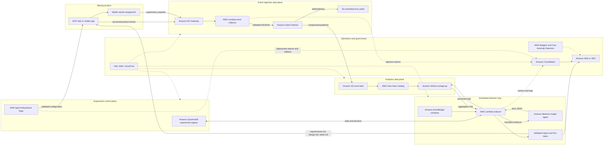

# GrowthForge AWS Architecture

## Architecture in one paragraph for judges

GrowthForge turns product behavior into a controlled AWS decision loop without placing analytics on the transactional path. API Gateway and Lambda validate versioned, no-direct-PII events; Amazon Data Firehose delivers them to an encrypted S3 event lake; Glue and Athena compute funnel, quality, and experiment evidence; DynamoDB records experiment state; and AWS AppConfig distributes validated flags with staged rollout and CloudWatch-alarm rollback. EventBridge starts a bounded analysis job that sends aggregates only to Amazon Bedrock, validates the returned insight, publishes through CloudWatch and SNS or SES, and converts the selected recommendation into Kiro-ready requirements, design, and tasks. IAM, KMS, CloudTrail, AWS Budgets, Cost Anomaly Detection, retention, query limits, and independent kill switches make the loop reviewable, reversible, and proportional to an early-stage startup.


## System diagram



## Request and data flow

### 1. Instrument the MVP

The product emits only events required to measure a named funnel or guardrail. Each event follows a versioned envelope and contains opaque identifiers. Revenue outcomes originate from a trusted server integration, such as a verified payment webhook, rather than a browser claim.

### 2. Validate at the boundary

API Gateway provides the event route, authentication integration, throttling, and request limits. The collector Lambda validates:

- Known event name and version
- Required fields and property allowlist
- Timestamp skew and environment
- Payload size and structure
- Direct-PII, credential, payment-data, and free-text prohibitions

The collector assigns trusted fields such as `received_at`, emits low-cardinality metrics, and submits newline-delimited records to Firehose. It does no analytical work on the request path.

### 3. Deliver to the event lake

Amazon Data Firehose buffers and compresses accepted records before writing S3 objects. The first version partitions by low-cardinality values:

```text
s3://growthforge-events-prod/
  validated/event_date=2026-06-08/event_name=checkout_started/...
  errors/event_date=2026-06-08/...
```

Firehose has an explicit error destination and delivery alarms. Because producers and delivery systems can retry, analytics deduplicates by `event_id` and the declared business key.

### 4. Catalog and query

The Glue Data Catalog stores the event schema. Explicit table definitions or partition projection are preferred for a controlled contract.

A dedicated Athena workgroup enforces:

- Encrypted result location
- Partition-aware production SQL
- Bytes-scanned limits
- Versioned funnel and experiment views
- Separate scheduled and exploratory query identities

S3 remains the replayable source. Raw events do not enter DynamoDB.

### 5. Control experiments

DynamoDB stores experiment metadata, state, flag version, owner, decision rules, result summary, and rollback record. Conditional writes enforce valid transitions:

```text
DRAFT -> BASELINING -> RUNNING -> PAUSED/STOPPED -> DECIDED -> ARCHIVED
```

AWS AppConfig distributes validated flag configuration and supports gradual deployments with CloudWatch-alarm rollback. The application performs stable assignment with an opaque key and experiment salt.

Assignment is not exposure. The application emits `experiment_exposed` only when the assigned behavior is visible or used.

### 6. Analyze on a schedule

EventBridge starts a daily or weekly analyzer Lambda. The analyzer:

1. Starts versioned Athena queries.
2. Checks freshness, duplicates, identity continuity, impossible ordering, and sample ratio.
3. Calculates funnel and experiment aggregates.
4. Persists the result ID and query version.
5. Invokes Bedrock only when the evidence contract is valid.

The cadence is deliberately batch-oriented. Early-stage teams rarely need real-time experiment decisions, and batch analysis reduces cost and operational load.

### 7. Generate a grounded insight

The Bedrock insight agent is a bounded model invocation workflow, not an autonomous decision maker. It receives:

- Analysis ID and data window
- Aggregate counts and rates
- Effect and uncertainty
- Guardrail status
- Data-quality findings
- Allowed decisions

It returns strict JSON with observation, interpretation, uncertainty, cited metric IDs, and one proposed action. Invalid output is rejected. If Bedrock is disabled or unavailable, the deterministic report still publishes.

### 8. Report and implement

The analyzer writes a durable report and updates the registry. CloudWatch provides operational signals; SNS or SES delivers notifications.

The selected recommendation becomes Kiro-ready:

- `requirements.md` with testable acceptance criteria
- `design.md` with architecture and failure behavior
- `tasks.md` with dependency-ordered implementation work

The generated artifacts do not bypass code review or deployment approval.

## Security model

- API trust appropriate to the producer, with throttles and quotas
- No direct PII by default
- S3 Block Public Access, TLS-only policies, controlled prefixes, and lifecycle
- KMS encryption where classification requires customer-managed keys
- Separate collector, Firehose, analyzer, insight, flag-reader, deployment, and human roles
- CloudTrail for management changes
- Aggregate-only model input and explicit Bedrock logging decision
- No user-controlled free text in model prompts

## Reliability and rollback

| Failure | Expected behavior |
| --- | --- |
| Collector transient failure | Producer retries with same `event_id` |
| Firehose delivery failure | Retry and controlled S3 error path; alarm and replay |
| Glue/Athena unavailable | Events remain durable; report becomes stale and alarms |
| DynamoDB conditional failure | State transition rejected; no silent overwrite |
| AppConfig unavailable | Use last-known-good cache; otherwise force control |
| Guardrail alarm during rollout | AppConfig deployment rolls back |
| Bedrock unavailable or over budget | Deterministic report only |
| Notification failure | Decision remains in durable registry/report store |

The product's transactional path remains independent. A complete analytics outage must not prevent a course purchase or other core transaction.

## Cost boundaries

GrowthForge avoids always-on analytics infrastructure. Cost is controlled through:

- Serverless, usage-based services
- Small event payloads and a minimal taxonomy
- Firehose buffering and compression
- S3 lifecycle and bounded retention
- Athena partitions, workgroup controls, and scan limits
- Cached AppConfig retrieval
- One scheduled Bedrock run per day by default
- Model call/token ceilings and an independent pause switch
- CloudWatch log retention and low-cardinality custom metrics
- AWS Budgets and Cost Anomaly Detection alerts

The system removes components when volume does not justify them. For very low traffic, a collector can write directly to S3 through a simpler batching path; for materially higher analytical demand, measured scan cost may justify Parquet compaction or another query architecture.

## Deployment stages

| Stage | Exposure | Exit criteria |
| --- | --- | --- |
| Development | Synthetic only | Contract, schema, and local assignment tests pass |
| Staging | Synthetic end to end | S3/Athena fixture, alarms, permissions, and rollback pass |
| Production shadow | Events, no treatment | Freshness, validity, identity, and cost stay within thresholds |
| Baseline | Control only | Baseline and sample plan approved |
| Internal | Staff/allowlist | UX and support workflow accepted |
| Canary | 5% eligible | No critical guardrail or sample-ratio failure |
| Ramp | 25% eligible | Data quality and operational alarms remain healthy |
| Target | Declared allocation | Run until predeclared decision condition |

Every stage has a named owner, start time, configuration version, and rollback action.
