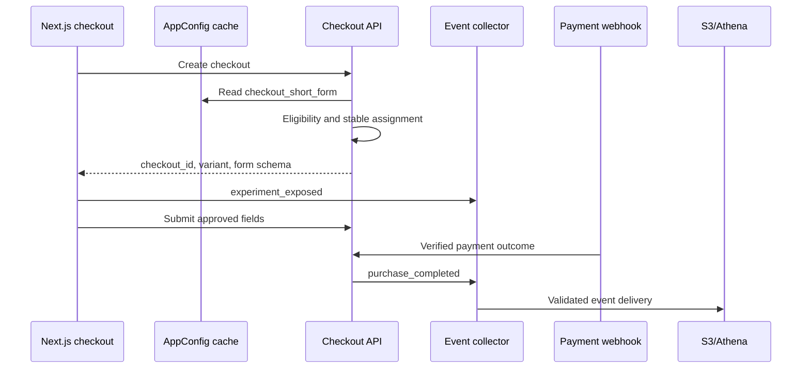

# Kiro-Ready Example

The following abbreviated artifacts implement the recommended Eduky experiment:

> Reduce checkout friction by testing a 4-field checkout variant against the current 7-field checkout.

They demonstrate traceability and task shape. A real generated specification should adapt paths and commands to the target repository.

---

# requirements.md

## Scope

Add a reversible checkout experiment that assigns eligible purchasers to the existing seven-field form or a four-field form, records actual exposure, measures verified purchase conversion, and forces control when integrity or guardrail checks fail.

## Non-goals

- Replacing the payment provider
- Building a general experimentation platform
- Sending direct PII or raw event rows to Amazon Bedrock
- Automatically shipping a winner without product-owner approval

## Glossary

| Term | Meaning |
| --- | --- |
| Eligible checkout | Individual web course purchase not in recovery, company-seat, internal, or unsupported flow |
| Assignment key | Opaque user ID, or server-issued checkout ID when anonymous |
| Exposure | The assigned checkout form is visible and interactive |
| Control | Existing seven-field form |
| Treatment | Four-field form with approved fields deferred until after purchase |

## Functional requirements

### REQ-EXP-001 Stable assignment

**User story:** As an experiment owner, I want an eligible checkout to receive one stable variant so that outcomes can be attributed consistently.

**Acceptance criteria**

- WHEN the same assignment key, experiment ID, salt, and allocation are evaluated, THE SYSTEM SHALL return the same variant across requests and instances.
- IF the feature flag is disabled or unavailable without a valid cache, THE SYSTEM SHALL return `control`.
- THE SYSTEM SHALL NOT use email, name, IP address, or another direct identifier in assignment.

### REQ-EXP-002 Treatment rendering

- WHEN an eligible checkout is assigned `treatment`, THE SYSTEM SHALL render exactly the approved four required fields.
- WHEN a checkout is ineligible, THE SYSTEM SHALL render control regardless of hash assignment.
- WHEN treatment is disabled, THE SYSTEM SHALL preserve the existing seven-field behavior.

### REQ-EVT-001 Exposure event

- WHEN the form becomes visible and interactive, THE SYSTEM SHALL emit `experiment_exposed` with experiment ID, variant ID, surface, event version, and opaque checkout/session identifiers.
- THE SYSTEM SHALL emit at most one qualifying exposure per experiment and checkout under the declared deduplication policy.
- THE EVENT SHALL NOT include field values or direct PII.

### REQ-MET-001 Primary outcome

- THE SYSTEM SHALL count a purchase only from the verified payment webhook.
- THE ANALYSIS SHALL calculate verified purchases per exposed eligible checkout within 24 hours.
- THE ANALYSIS SHALL report sample size, effect size, interval, and sample-ratio check.

### REQ-MET-002 Guardrails

- THE SYSTEM SHALL calculate checkout-error, duplicate-order, refund-within-seven-days, p95 latency, and activation-within-24-hours by variant.
- IF a critical guardrail breaches its approved threshold, THE SYSTEM SHALL alarm and make treatment rollback available.

### REQ-CFG-001 Flag safety

- AWS AppConfig SHALL validate allocation, variant names, field count, and experiment ID before deployment.
- The production deployment SHALL use internal, 5%, 25%, and target-allocation stages.
- A CloudWatch alarm entering `ALARM` during deployment SHALL cause AppConfig rollback where configured.

### REQ-SEC-001 Data minimization

- Event schemas SHALL use property allowlists.
- Direct PII, payment details, authentication material, and free-form text SHALL be rejected.
- Amazon Bedrock SHALL receive aggregate metrics only.

### REQ-COST-001 Cost boundary

- Scheduled insights SHALL run no more than once daily by default.
- A run SHALL make no more than two Bedrock model calls.
- THE SYSTEM SHALL support disabling Bedrock without disabling event ingestion or deterministic reports.

### REQ-OPS-001 Kill switch

- An authorized operator SHALL be able to force all new evaluations to control without an application deployment.
- The rollback procedure SHALL be exercised in staging before production treatment exposure.

---

# design.md

## Context

The largest observed loss is between `checkout_started` and `checkout_details_submitted`. The experiment tests form-field friction while preserving a server-verified purchase outcome.

## Component design



## Assignment

```text
if flag.enabled is false:
    return control
if checkout is not eligible:
    return control

material = experiment_id + ":" + salt + ":" + opaque_assignment_key
bucket = first_8_bytes(SHA256(material)) mod 10000
eligible_ceiling = allocation_percent * 100

if bucket >= eligible_ceiling:
    return control

variant_bucket = bucket mod sum(variant_weights)
return weighted_variant(variant_bucket)
```

The assignment response includes the AppConfig version. It does not emit exposure. The browser emits exposure only after the form is visible and interactive.

## AppConfig document

```json
{
  "checkout_short_form": {
    "enabled": false,
    "experiment_id": "checkout-friction-v1",
    "allocation_percent": 0,
    "salt": "checkout-friction-v1-a",
    "variants": {
      "control": 50,
      "treatment": 50
    },
    "treatment_fields": 4
  }
}
```

The semantic validator rejects unknown variants, allocation outside 0-100, variant weights not totaling 100, treatment fields outside the approved set, or an experiment ID not in `DRAFT`/`BASELINING`/`RUNNING`.

## Event additions

```json
{
  "event_name": "experiment_exposed",
  "event_version": 1,
  "properties": {
    "experiment_id": "checkout-friction-v1",
    "variant_id": "treatment",
    "surface": "web_checkout",
    "appconfig_version": "opaque-version"
  }
}
```

## Failure behavior

| Failure | Behavior |
| --- | --- |
| AppConfig fetch fails, cache exists | Use last-known-good configuration |
| AppConfig fetch fails, no valid cache | Force control |
| Exposure event fails | Checkout continues; client retries with same event ID |
| Analytics unavailable | Preserve events; no experiment decision |
| Bedrock unavailable | Publish deterministic report |
| Critical guardrail alarm | Roll back configuration and force control |

## Traceability

| Requirement | Components |
| --- | --- |
| REQ-EXP-001 | Assignment module, AppConfig cache |
| REQ-EXP-002 | Checkout schema renderer |
| REQ-EVT-001 | Browser instrumentation, collector schema |
| REQ-MET-001/002 | Athena views and scheduled analyzer |
| REQ-CFG-001 | AppConfig profile, validators, deployment strategy |
| REQ-SEC-001 | Collector allowlist, aggregate insight input |
| REQ-COST-001 | EventBridge schedule, Bedrock caller limits |
| REQ-OPS-001 | AppConfig kill switch and runbook |

---

# tasks.md

- [ ] **GF-001 - Add experiment fixtures and contract tests**  
  Requirements: `REQ-EVT-001`, `REQ-MET-001`, `REQ-SEC-001`  
  Create valid/invalid `experiment_exposed`, purchase, refund, error, and activation fixtures. Include direct-PII canaries and duplicate IDs.  
  Done when the fixture counts and expected funnel outcomes are hand-calculated and tests fail for prohibited fields.

- [ ] **GF-002 - Version the event schemas**  
  Requirements: `REQ-EVT-001`, `REQ-SEC-001`  
  Add the exposure schema and approved checkout properties to the shared event-contract package.  
  Done when unknown names/versions fail closed and schema compatibility tests pass.

- [ ] **GF-003 - Implement stable assignment as a pure module**  
  Requirements: `REQ-EXP-001`  
  Add eligibility and hash-bucket functions with no network dependency.  
  Done when golden-vector tests prove stability, approximate allocation over fixtures, salt isolation, and control fallback.

- [ ] **GF-004 - Add the AppConfig profile and validators**  
  Requirements: `REQ-CFG-001`, `REQ-OPS-001`  
  Define dev/staging/prod profiles, JSON Schema, semantic validation, cached retrieval, and default-control behavior in IaC.  
  Done when invalid allocation fails deployment and a fetch failure test returns control.

- [ ] **GF-005 - Render the four-field variant behind the assignment response**  
  Requirements: `REQ-EXP-002`  
  Add the approved treatment schema without changing payment handling.  
  Done when component tests cover eligible treatment, eligible control, ineligible control, and disabled-flag control.

- [ ] **GF-006 - Emit exposure on actual render**  
  Requirements: `REQ-EVT-001`  
  Instrument the interactive form boundary with a stable event ID and deduplication policy.  
  Done when tests prove assignment alone emits nothing and rerender does not create a second qualifying exposure.

- [ ] **GF-007 - Preserve server-authoritative outcomes**  
  Requirements: `REQ-MET-001`, `REQ-MET-002`  
  Add experiment context linkage to verified payment, error, refund, latency, and activation events without trusting client outcome fields.  
  Done when webhook tests reject forged outcomes and event payloads contain no direct PII.

- [ ] **GF-008 - Add Athena experiment views and integrity checks**  
  Requirements: `REQ-MET-001`, `REQ-MET-002`  
  Add versioned SQL for first exposure, eligible outcome, guardrails, sample ratio mismatch, and late-data policy.  
  Done when the queries reproduce the synthetic fixture and prevent double counting.

- [ ] **GF-009 - Configure staged rollout and rollback alarms**  
  Requirements: `REQ-CFG-001`, `REQ-OPS-001`  
  Add internal, 5%, 25%, and target strategies plus payment-error, 5XX, and duplicate-order alarms.  
  Done when a staging alarm automatically returns the previous AppConfig version.

- [ ] **GF-010 - Add bounded daily analysis and fallback report**  
  Requirements: `REQ-COST-001`, `REQ-SEC-001`  
  Send aggregate metrics to Bedrock with a two-call cap and validate response JSON.  
  Done when model failure publishes the deterministic report and no raw event row reaches the model input.

- [ ] **GF-011 - Exercise the production-readiness checklist**  
  Requirements: all  
  Run synthetic end-to-end, PII rejection, stable assignment, sample-ratio, alarm, kill-switch, replay, permission, and budget-recipient tests.  
  Done when owners approve the evidence and the experiment remains disabled pending baseline.

- [ ] **GF-012 - Collect baseline and approve sample plan**  
  Requirements: `REQ-MET-001`, `REQ-MET-002`  
  Run the approved baseline period, calculate sample/runtime assumptions, and set a decision date.  
  Done when the product owner signs the pre-experiment decision record.
